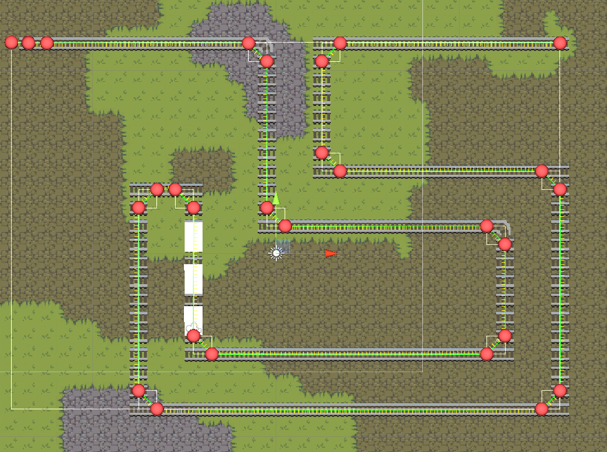

# “Railroaded” (Working Title)
v1.0.1

_Benjamin Mastripolito, Haydn Jones, Marcelo Dominguez_

# Download
See [Releases](https://github.com/benpm/cse389_game/releases) for executable downloads.

# How to Play
Use the mouse to fire your weapon at enemies.

# Overview
## Theme / Setting / Genre
* Theme: Wild West with Fruit
* Setting: The Desert
* Genre: Tower Defense

## Core Gameplay Mechanics (Brief)
* Build a train and defend it from enemies (towers, mobile enemies)
* Train cars have mounted weapons to be used to defend your precious cargo
* Train run by fruit people, illegally trading fruit-prisoners
* Fruit bandits attack your train
* Go through multiple levels and protect your cargo so it can be sold
* Money gained can be used to buy new train cars, upgrade and repair the train

## Target Platforms
Windows, MacOS, Linux

## Project Scope
### Game Time Scale
Four months

### Team Structure
Haydn Jones
*   Design, programming
*   [https://github.com/haydn-jones/](https://github.com/haydn-jones/)

Benjamin Mastripolito (Team Lead)
*   Design, programming
*   [https://github.com/benpm/](https://github.com/benpm/)

Marcelo Dominguez
*   Art, design
*   [https://github.com/Okimarcelo](https://github.com/Okimarcelo)

### Licenses / Hardware / Other Info
Software to be used: Unity, Aseprite

GitHub: [https://github.com/benpm/cse389_game](https://github.com/benpm/cse389_game)

## Influences
Classic tower defense-genre games such as Bloons Tower Defense.

## The Elevator Pitch
Imagine a tower defense, but you defend a train manned by fruit, carrying fruit felons and criminals to be sold off in auction, perhaps to be juiced if they were extra bad. Your well-earned cash can be used to buy, upgrade, and repair train cars.

# What Sets This Project Apart?
*   A spin on the tower defense genre where you play the infiltrator
*   Irresistibly delectable fruit-centric theme
*   Hilarious fruit-based dialogue and story
*   Fast-paced, gun-slinging, eyebrow-singing gameplay

# Story and Gameplay
## Story
You are a fruit bounty hunter set on turning a profit, piloting an armored train. Your goal is to zing from town to town through the desert selling wanted criminals to the questionably open-minded authorities. Unfortunately, you are subject to a never-ending onslaught of fruity bandits that aim to harsh your mellow. Stay above the poverty line by protecting your precious cargo with the finest deadly weapons and armored cars. Once you sell off your prisoners to slavery for an affordable price, you can use your hard-earned clams to purchase all manner of upgrades and enhancements. Become the finest locomoting bounty hunter in the west!

## Gameplay
The gameplay involves creating, upgrading, repairing, and primarily, protecting your train. Waves of enemies and enemy turrets will be bombarding your train with attacks. Your goal is to protect your cargo car from being stolen by the enemy bandits. You play through levels until you reach a town, in which you will be able to sell your cargo (if you didn’t lose it). If a train car gets destroyed, all the trailing cars get detached from the train and you will lose those as well.

# Assets Used
- [Desert Tileset](https://opengameart.org/content/desert-tileset-0) CC BY 3.0
